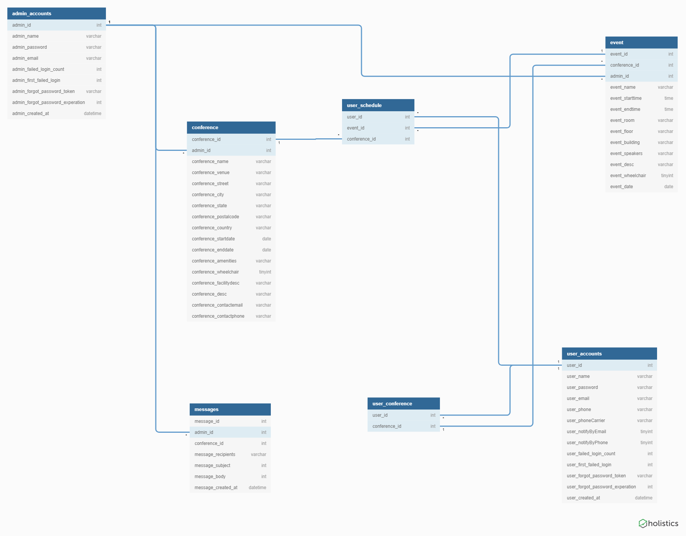

## 1.0 Project Overview
Title: Symposium Scheduler Web Application
Dates Worked On: Jan 2019 - June 2019
Team Members: TJ Breitenfeldt, Andrew Bosco, Chester Southwood, Tatyana Hubbard

This project is a web-based application that allows users to manage their own personal schedule for symposiums/conferences.
It also allows administrators to create/manage/edit symposiums/conferences that they are in charge of.
The purpose of this application is to replace the application EWU uses currently (Sched) with an application that is accessible.

#### Technologies:

Front-End:

HTML
SASS (CSS extension)
Javascript w/ JQuery

Back-End:

PHP
MySQL

Section 1 Overview:

1.1 File and Folder Structure
1.2 Database Structure

### 1.1. File and Folder Structure

This section of our documentation is a small description of what each folder and file is used for within this project.

#### Root (application) folder

Within the application folder, it contains these folders:
* admin folder: This folder contains almost copies of the php files within the root, except slightly changed for specific admin use.
* conferenceAPI folder: Contains the files
* css folder: This folder contains files for our project's css and SASS.
* databaseUtil folder: This folder contains the PDO in php to our database.
* javascriptLoads folder: This folder contains HTML / PHP files that will be loaded into the index.php's innerContent div when a javascript action occurs.
* js folder: This folder contains all of our javascript code for the project.
* loginAPI folder:
* phpIncludes folder: 
* proxies folder: This folder contains our proxy code that accesses the database with either a userID or adminID.

This folder contains these files (which are mainly HTML files wrapped as a php file):
* authenticateUser.php: A php file that contains a function to test if the user is registered or not for login purposes.
* config.php: A php file that defines and holds constants for the project.
* error.php: A php (HTMl) file that is shown if an error has occurred.
* forgotPassword.php: A php (HTML) form that can send an email to the user to reset the password.
* index.php: Our main php / HTML file that contains sidebars, the menu, references to the userJS folder, and a "content" div for javascript use.
* login.php: A php (HTML) form to login to the website.
* logout.php: A php file to log the user out of the website and go back to the login page.
* register.php: A php (HTML) form to register as a user for the website.
* resetForgotPassword.php: A php (HTML) form to reset the password after going through the forgotPassword.php file.

#### Admin folder

This folder contains these files (which are mainly HTML files wrapped as a php file): 
* authenticateUser.php: A php file that contains a function to test if the login was an admin.
* config.php: A php file that defines and holds constants for the project on only the admin side.
* error.php: A php (HTMl) file that is shown if an error has occurred.
* forgotPassword.php: A php (HTML) form that can send an email to the admin to reset the password.
* index.php: Our main php / HTML file that contains admin specific accessibility and does not contain much css.
* login.php: A php (HTML) form to login to the website.
* logout.php: A php file to log the admin out of the website and go back to the login page.
* register.php: A php (HTML) form to register as an admin for the website (Can only be done through another admin).
* resetForgotPassword.php: A php (HTML) form to reset the password after going through the forgotPassword.php file.
* resetPassword.php: A php (HTML) form the reset the password.

#### conferenceAPI folder
	
This folder contains these files:
* delete.php: The handler for the http delete request for the API
* get.php: the handler for the http get request for the API 
* index.php: The main file for the API, all API requests are directed through this file
* post.php: the handler for the http post request for the API  
* put.php: the handler for the http put request for the API  

#### databaseUtil folder

This folder contains these files:
	* creds.php: The credentials and database settings defined as global constants for the database utility 
	* pdoUtil.php: The database utility used by all php API code in the project

#### javascriptLoads folder

This folder contains these files:
* aboutConference.php: This file is loaded into the root's index.php (in place of the current loaded InnerContent tag) and shows information about a conference on load or when the home page button is chosen.
* conferenceChooser.php: This file is loaded into the roots's index.php file when a User is not registered for a conference or when a user wants to change their conference
* conferenceSchedule.php: This file is loaded into the root's index.php file when a user want to look at the full conference table
* editSchedule.php: This file is loaded into the roots's index.php file when the user wants to add or delete an event from their schedule
* resetPassword.php: This file is loaded as a form onto the page when the user chooses the "Reset Password" button.
* showSchedule.php: This file is loaded into the index.php's innerContent div and shows the user's conference schedule
* userSettings.php: This file is loaded into the index.php's innerContent div and shows the user's current settings, which can be changed in this form.

#### js folder

Within the js folder, it contains these folders:
* adminJs: A folder that holds javascript functionality for the admin side only.
* conferenceAPIJs: contains a single file that is a wrapper for ajax calls to the conference API
* loginSystemJs: contains a single file that manages form collection and posts using ajax to the login API
* userJs: A folder that holds the javascript for frontend user functions.
* utilityJs: A folder that holds a useful javascript file to assist in other javascript modules.

##### js/adminJs

This folder contains these files:
* conferenceManager.js: a javascript file that contains the administrator dashboard functions for constructing and dynamically changing the admin UI.
* generateHTML.js: A helper javascript file for the admin dashboard used to construct and return strings of html.
	
##### js/conferenceAPIJs

This folder contains this file:
* databaseFunctions.js: A javascript file that uses either the conferenceAPI folder or proxies folder to easily access the database for the other javascript modules.

##### js/loginSystemJs

This folder contains this file:
* loginAJAX.js: The javascript file used to collect and post data to the login API, used for: login.php, register.php, forgotPassword.php, resetForgotPassword.php, and resetPassword.php html files for both the user and admin sides.

##### js/userJs

This folder contains these files:
* mainSchedule.js: A javascript file that is used to get the main conference's information, have the functionality for the conference, and to check whether the user is even registered to a conference.
* menu.js: A javascript file that contains most of the frontend's functionality; which is the sidebar's use, the click of every option in the side bar, and the creation of cookies.
* userAccountRegistration.js: A javascript file that only has a function to toggle the phone aspect of the register.php file.
* userSchedule.js: A javascript file that creates the user's schedule table and contains the table's functionality.
* userSettings.js: A javascript file to update and add information to the userSettings.php file in javascriptLoads.

##### js/utilityJs

This folder contains this file:
* util.js: A javascript file that can be used anywhere to assist in use. The main functions it currently does is notify the screen reader and parse dates.

#### loginAPI folder

Within the loginAPI folder, it contains one folder:
* PHPMailer: This folder is a third party library that we use to send mail.

This folder contains these files:
* dataValidation.php: A php file that contains a collection of functions to currently only validate the registration form for the login system.
* forgotPasswordFunctions.php: A php file for using a provided email to look up the user account tied to that email address, and send a reset forgot password link to that email address.
* includeConfig.php: A php wrapper for the config.php file found in the root directory and the admin directory, used to identify which type of user is logged in, weather a user or admin, and will include the correct config.php file.
* loginFunctions.php: A php file used for handling the provided username and password, and checking against the database to see if the username and password match the username and password in the database.
* logoutFunctions.php: A small php file to log a user out by destroying the current session and redirecting the user to the login page.
* registerFunctions.php: A php file used to handle the provided registration data, validation and scrubbing of the data, hashing of the password, and insertion into the database.
* resetForgotPasswordFunctions.php: The php file used to handle the resetting of a forgot password. Depends on the forgotPassword.php file to be run first to generate a token. These functions will then check to make sure the provided token and email address are correct, then reset the users password.
* resetPasswordFunctions.php: A php file used to reset a users password, depends on the user already knowing his or her existing password. This file will check to make sure the existing password is valid based on the current user name that is logged in, then reset the password for that account.

#### phpIncludes folder

This folder contains these files:
* accesibilityMenuOnly.php: A stand alone html file that is included into all pages except for the user control panel to allow users to change the font or page color from anywhere.
* adminHeader.php: The stand alone html file that is included in all of the html admin files in the admin folder at the top inside a <head> tag.
* footer.php: The stand alone html file that is included at the bottom of all of our html files to show the footer information.
* userHeader.php: The stand alone html file that is included at the top in all of the html user files in the root directory inside a <head> tag.

#### proxies folder

This folder contains these files:
* deleteProxy.php: deleteProxy is used by both users and admins to delete data from the database.
* getProxy.php: getProxy is used to access the database using either the admin id or user id to get information.
* httpRequester.php:  HttpRequester is referenced within 2.2. This file is used to set up how the proxies work. The only thing that will potentially need to be changed is the domain.
* postProxy.php: postProxy is used by both users and admins. Admins use this more, but it is used to add to tables for the user.
* putProxy.php: putProxy is used by only the admin side. This is used to edit information stored within the database.

### 1.2. Database Structure
Database Name: Db_a444c6_senior
Tables:

admin_accounts - admin account information
user_accounts - user account information
conference - conference information
event - event information
user_schedule - user event schedule information
user_conference - user conference information

admin_accounts:
Primary Key - admin_id

user_accounts:
Primary Key - user_id

conference:
Primary Key - conference_id
Foreign Key - admin_id

event:
Primary Key - event_id
Foreign Key - admin_id, conference_id

user_schedule:
Foreign Keys - user_id, event_id, conference_id

user_conference:
Foreign Keys - user_id, conference_id

